# Agent Fabric

[](https://opensource.org/licenses/MIT)
[](https://www.python.org/downloads/)
[](https://api.slack.com/apps)
[](https://core.telegram.org/bots)
[](https://docs.anthropic.com/en/docs/claude-code)
[](https://docs.cursor.com/cli/using)
[](https://developers.openai.com/codex/sdk)
[](https://opencode.ai/docs/sdk/)

**One channel connection.** 
**One Project Orchestrator.** <br>
**Every workspace runs through its own isolated Workspace Orchestrator.** <br> 
**Write Code and Manage your project wherever you are**

---

Agent Fabric is an orchestration layer for project trees.  <br>
A message arrives from Slack or Telegram, <br>
the **Project Orchestrator (PO)** routes it, builds a dependency-aware execution plan, <br>
and delegates each workspace task to a **Workspace Orchestrator (WO)**. <br>

It began as an expansion of [claude-code-tunnels](https://github.com/matteblack9/claude-code-tunnels) and evolved into a runtime-neutral control plane for multi-workspace agent execution.

This version keeps the Python control plane, but expands execution beyond a single-runtime model:

| Area | Runtime / Component | Behavior |
|------|----------------------|----------|
| Execution | `claude` | Runs through the existing Python `claude-agent-sdk` |
| Execution | `cursor` | Runs through the local `cursor-agent` CLI |
| Execution | `codex` | Runs through a local Node bridge that uses the official `@openai/codex-sdk` |
| Execution | `opencode` | Runs through the same bridge with `@opencode-ai/sdk` |
| Setup | Initial setup | Handled by a Textual TUI that proposes the `PO` root, `ARCHIVE` path, workspace candidates, WO runtime assignments, and root guidance files |

Guidance is runtime-aware:

| Runtime | Preferred guidance | Additional behavior |
|---------|---------------------|---------------------|
| `claude` | `CLAUDE.md`, existing `.claude/` memory/rules | Prioritizes Claude-specific guidance files and memory |
| `cursor` | `.cursor/rules` | Also reads `AGENTS.md`, `CLAUDE.md`, and legacy `.cursorrules` |
| `codex` | `AGENTS.md` | Also follows explicit repo instructions |
| `opencode` | `AGENTS.md` | Can use `opencode.json` and `.opencode/skills/`; requires provider login before execution |

Short glossary:

- **PO(Project Orchestrator)**: the control plane that routes requests, builds phases, and coordinates execution
- **WO(Workspace Orchestrator)**: the runtime worker assigned to one workspace
- **Workspace**: a real directory that contains code or documents
- **Remote Workspace**: a workspace executed through the remote listener on another host or pod

---

## Micro-Agent Architecture (MAA)

Just as **Microservice Architecture (MSA)** decomposed the monolith into independently deployable services, <br>
Agent Fabric decomposes one large assistant session into independently executing workspace workers. Each WO owns one workspace, one runtime, and one bounded context.

We call this pattern **Micro-Agent Architecture (MAA)**.

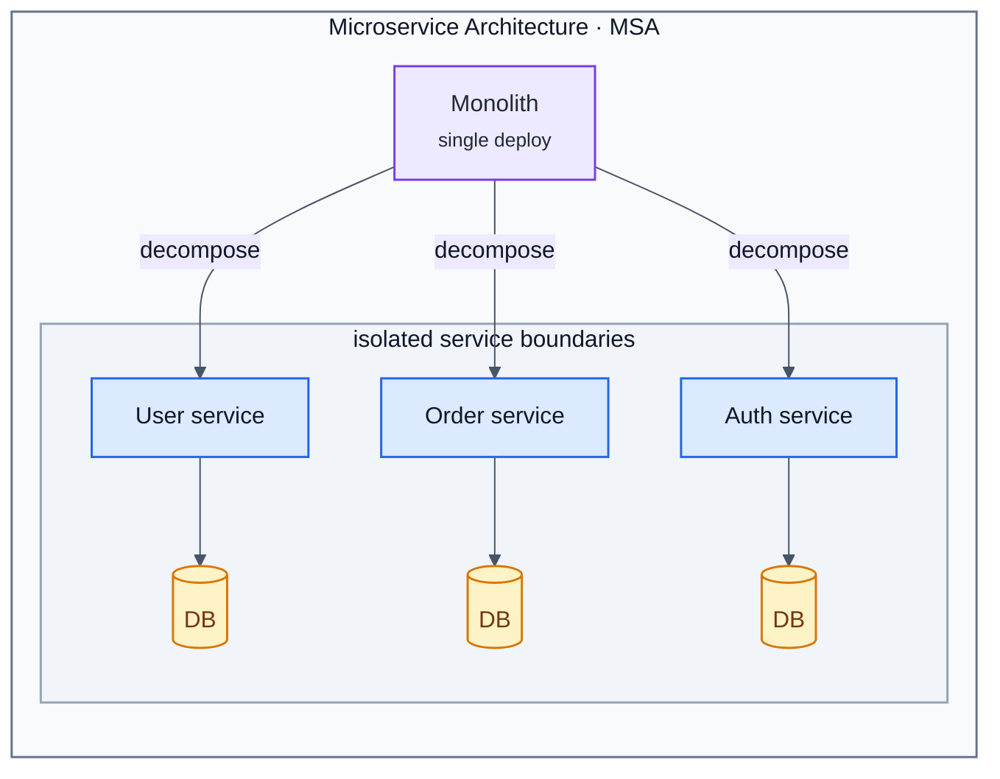

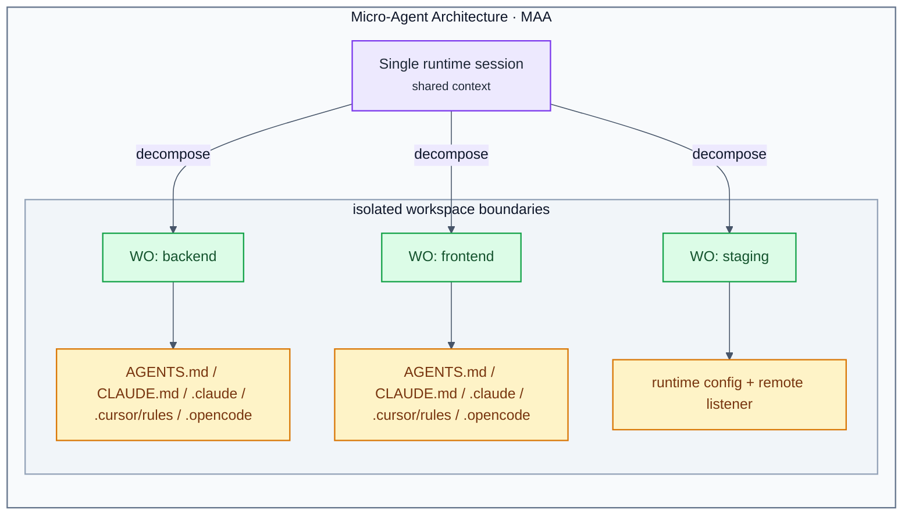

> **monolith ≡ single session · microservice ≡ workspace worker · DB ≡ workspace guidance + runtime boundary**

### Core Principles — Shared Between MSA and MAA

| Principle | MSA | MAA |
|-----------|-----|-----|
| **Unit of decomposition** | Service | Workspace worker (`WO`) |
| **State ownership** | Each service owns its DB | Each WO owns its workspace guidance and runtime |
| **Isolation boundary** | Process / container | Fresh runtime session with `cwd=workspace/` |
| **Inter-unit communication** | API calls / message queue | Upstream context passed between phases |
| **Orchestration** | API gateway / service mesh | Project Orchestrator (`PO`) |
| **Scaling** | Add service instances | Add workspaces or remote listeners |
| **Failure isolation** | One service fails, others continue | One WO can fail without collapsing the whole plan |

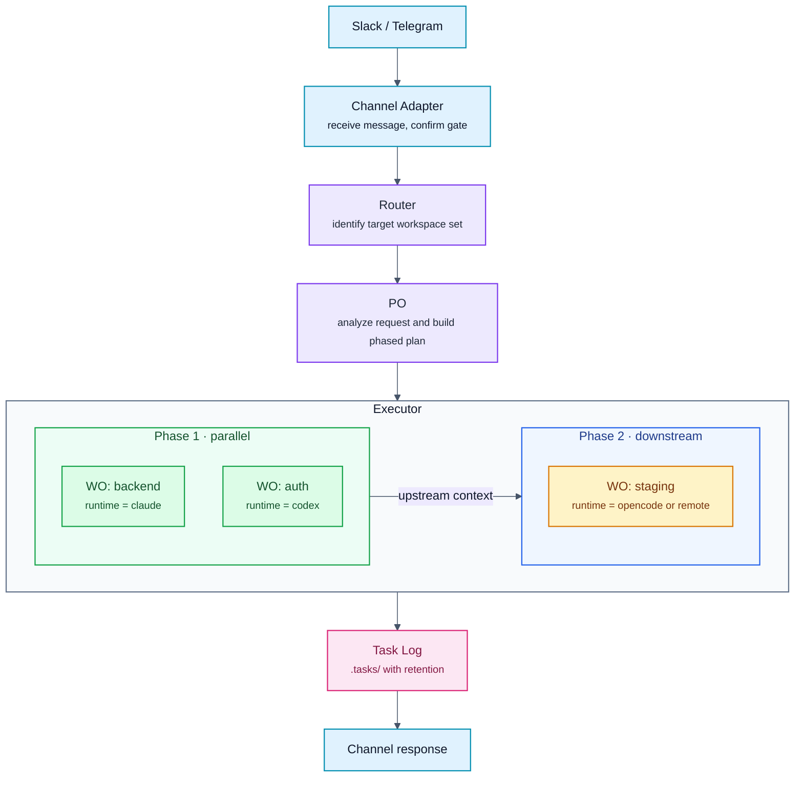

---

## Why This Over Claude Code's Built-in Channels?

Claude Code has a Channels feature that forwards chat messages into a running CLI session. Agent Fabric solves a different problem.

| Feature | Claude Code Channels | Agent Fabric |
|---------|---------------------|---------------------|
| **Architecture** | Single CLI session, single cwd | Always-on PO with phased workspace orchestration |
| **Session model** | Bound to a running session | Background daemon with per-workspace execution |
| **Workspace orchestration** | None | Phase-based planning with upstream context passing |
| **Session isolation** | Shared session | One isolated WO per workspace |
| **Runtime** | Single Claude session bridge | `claude`, `cursor`, `codex`, `opencode` through one control plane |
| **Remote workspaces** | Not supported | HTTP listener for remote hosts and pods |
| **Task logging** | None | `.tasks/` logging with runtime metadata |
| **Confirm gate** | None | Built-in confirm/cancel flow |
| **Setup** | Connect a channel to one session | TUI discovers PO root, workspaces, and runtimes |

**In short**: Channels is a message bridge into one session. Agent Fabric is an orchestration layer that can coordinate multiple workspaces and multiple runtimes from one shared channel.

---

## Team Collaboration — Shared Channel, Zero Handoff

Traditional setups tie the assistant to one person's laptop or one long-running terminal session. Agent Fabric flips that: the orchestrator lives in the shared channel, not in one person's shell.

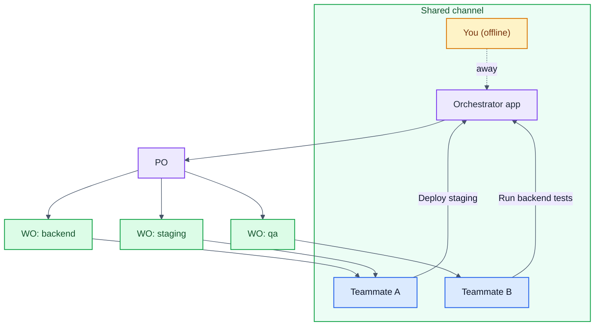

**No handoff required.** The orchestrator already knows workspace structure through `orchestrator.yaml`, shared instructions in `AGENTS.md`, Claude-specific context in `CLAUDE.md` or `.claude/`, Cursor-specific rules in `.cursor/rules` or `.cursorrules`, OpenCode-specific config in `opencode.json` or `.opencode/`, and workspace-specific runtime settings. A teammate does not need your local terminal state or your memory of "how this repo works."

| Scenario | Without Tunnels | With Tunnels |
|----------|----------------|--------------|
| You're on vacation | Team waits or guesses | Team uses the shared channel |
| New team member joins | Needs project-by-project onboarding | Asks the channel and gets routed correctly |
| Urgent hotfix at 3 AM | Someone SSHs in and runs commands manually | Anyone with channel access can trigger the pipeline |

---

## How Delegation Works

The PO reads a natural-language request, decides which workspaces are involved, determines dependency order, and hands each workspace-specific task to a WO.

Two properties make that useful:

**1. Isolated execution per workspace.** Each WO runs in one workspace with one runtime and one working directory.

**2. Phase-aware coordination.** Workspaces in the same phase run in parallel. Downstream phases receive upstream summaries as context.

**3. Explicit workspace registration.** The setup TUI proposes workspace candidates, and the final `workspaces:` block becomes the source of truth for planning and execution.

### Delegation Flow

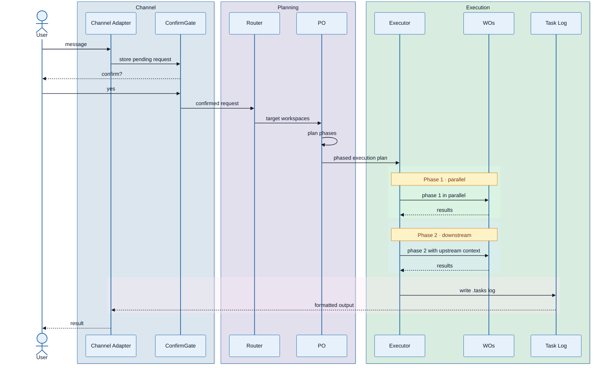

### Workspace Structure

The current branch is optimized for one `PO` root with an explicit workspace registry:

```text
po-root/
├── orchestrator/
├── orchestrator.yaml
├── start-orchestrator.sh
├── ARCHIVE/
├── backend/
├── frontend/
└── services/
    └── staging/
```

The `workspaces:` block in `orchestrator.yaml` is the preferred source of truth. Legacy directory scanning and `remote_workspaces:` fallback still exist so older setups keep working.

### Delegation Scenarios

Below are three concrete examples of how one request becomes phased WO execution.

#### Scenario 1 — Multi-workspace feature and deploy

> **Slack**: _"Add auth to the backend, wire the frontend login flow, then deploy staging"_

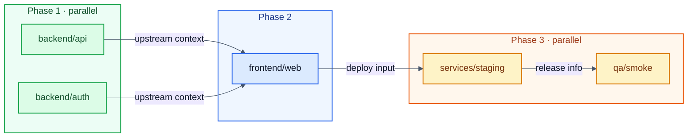

#### Scenario 2 — Shared library upgrade across runtimes

> **Telegram**: _"Upgrade the shared types package and update all dependent workspaces"_

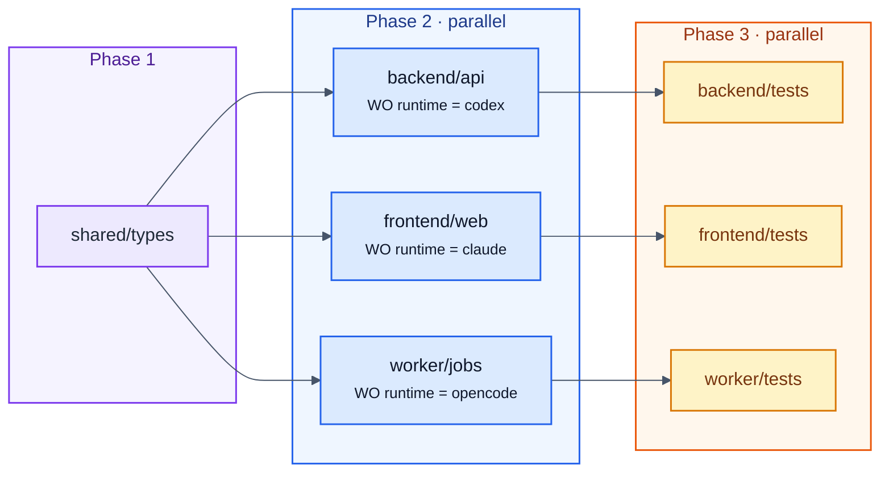

#### Scenario 3 — Local to remote handoff

> **Slack**: _"Change the deployment manifest and roll it out to the remote staging workspace"_

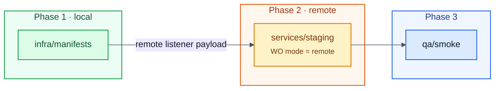

---

## Quick Start

```bash
git clone https://github.com/matteblack9/agent-fabric.git
cd agent-fabric

./setup.sh
./start-orchestrator.sh --fg
```

The repository is published as `agent-fabric`.

The setup wizard:

1. checks whether the current folder already looks like a `PO` root
2. suggests the `PO` root, `ARCHIVE` path, and workspace candidates
3. collects Slack or Telegram credentials with masked input when those channels are enabled, then writes them under `ARCHIVE/` for the channel runtimes to use
4. lets you assign one `WO` per selected workspace
5. writes `orchestrator.yaml` and `start-orchestrator.sh`, creates `AGENTS.md` / `CLAUDE.md` when missing, and appends or refreshes a managed Project Orchestrator integration block when those markdown files already exist; Cursor reads `.cursor/rules` if your repo already uses it
6. shows the exact commands to run next
7. opens the selected default runtime for a remote Workspace Orchestrator follow-up, asking whether any remote Workspace Orchestrators should be connected and where their credentials should be stored under `ARCHIVE/`

`setup.sh` is the primary entrypoint.

---

## How To Run

If you are seeing terms like `PO` and `WO` for the first time, read this section as:

- **PO root**: the directory that contains `orchestrator/`, `orchestrator.yaml`, `start-orchestrator.sh`, and `ARCHIVE/`
- **Workspace**: a real target directory such as `backend/` or `services/staging/`
- **WO**: the runtime worker assigned to one workspace

Operationally, the tree looks like this:

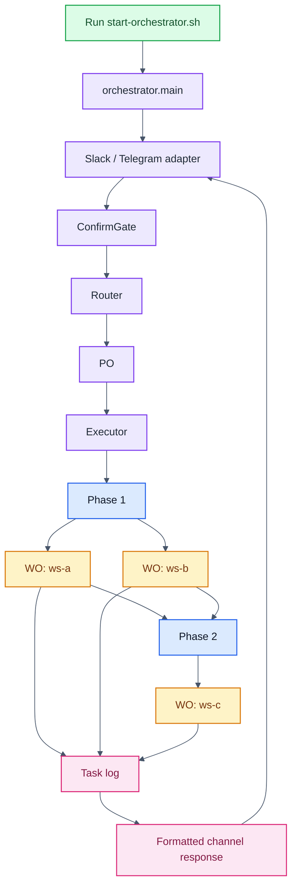

After setup has written `orchestrator.yaml` and `start-orchestrator.sh`, run from the `PO` root:

```bash
# Foreground, recommended for first run or debugging
./start-orchestrator.sh --fg

# Background daemon mode
./start-orchestrator.sh

# Re-open setup
.venv/bin/python -m orchestrator.setup_tui

# Follow logs
tail -f /tmp/orchestrator-$(date +%Y%m%d).log

# Stop background execution
kill $(pgrep -f "orchestrator.main")
```

---

## Commands

| Command | Description |
|---------|-------------|
| `.venv/bin/python -m orchestrator.setup_tui` | Interactive setup wizard for PO/workspace/WO configuration |
| `/setup-orchestrator` | Plugin skill shortcut that launches the setup workflow |
| `/connect-slack` | Add Slack credentials to an existing orchestrator |
| `/connect-telegram` | Add Telegram credentials to an existing orchestrator |
| `/setup-remote-project` | Deploy the remote listener through SSH or kubectl |
| `/setup-remote-workspace` | Register a specific remote workspace |

---

## Architecture

### Component Overview

```text
po-root/
├── orchestrator/
│   ├── __init__.py              # config loading, workspace/runtime resolution
│   ├── main.py                  # entry point
│   ├── server.py                # ConfirmGate, planning, execution flow
│   ├── router.py                # target identification
│   ├── po.py                    # phased execution planning
│   ├── executor.py              # phase-by-phase WO execution
│   ├── direct_handler.py        # non-workspace task handling
│   ├── task_log.py              # .tasks/ writer
│   ├── sanitize.py              # prompt safety checks
│   ├── http_api.py              # optional HTTP surface
│   ├── setup_tui.py             # Prompt-driven setup wizard
│   ├── setup_support.py         # setup discovery and rendering helpers
│   ├── channel/
│   │   ├── base.py              # shared confirm/cancel/session flow
│   │   ├── session.py           # per-source conversation context
│   │   ├── slack.py             # Slack adapter
│   │   └── telegram.py          # Telegram adapter
│   ├── runtime/
│   │   ├── __init__.py          # runtime-neutral execution layer
│   │   └── bridge.py            # persistent Node bridge client
│   └── remote/
│       ├── listener.py          # standalone remote listener
│       └── deploy.py            # SSH/kubectl deployment helper
├── bridge/
│   ├── daemon.mjs               # Node bridge process
│   ├── lib/runtime.mjs          # Codex/OpenCode runtime calls
│   └── tests/runtime.test.mjs
├── templates/
├── skills/
├── orchestrator.yaml
├── start-orchestrator.sh
├── AGENTS.md
├── CLAUDE.md
├── .cursor/
├── opencode.json
├── .opencode/
├── package.json
├── requirements.txt
└── requirements-dev.txt
```

### Multi-Runtime Structure

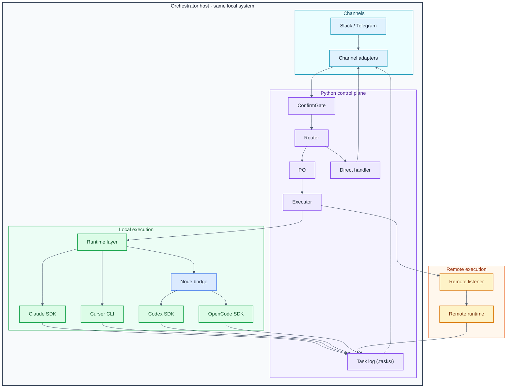

### Agent Model Strategy

| Role | Default runtime | Max turns | Responsibility |
|------|-----------------|-----------|----------------|
| Router | `claude` | 8 | Fast target identification |
| PO | `claude` | 15 | Phased execution planning |
| Executor | `claude` | 5 | Workspace execution |
| DirectHandler | `claude` | 30 | Non-workspace operations |
| JSON Repair | `claude` | 1 | Malformed JSON recovery |

### Runtime Resolution Order

Runtime selection follows this order:

1. `workspaces[].wo.runtime`
2. `runtime.roles[role]`
3. `runtime.default`
4. fallback `claude`

### Runtime Guidance Files

Runtime guidance is runtime-aware. The same repository can expose different instructions to different coding agents:

| Runtime | Primary guidance | Characteristics | Best use |
|---------|------------------|-----------------|----------|
| `claude` | `CLAUDE.md` and `.claude/` | Hierarchical project memory, rules, and existing Claude workflows are loaded naturally through the Python SDK path | Reusing existing Claude Code project setups without rewriting guidance |
| `cursor` | `.cursor/rules`, `AGENTS.md`, `CLAUDE.md`, legacy `.cursorrules` | Cursor CLI loads project rules from `.cursor/rules`, also reads `AGENTS.md` and `CLAUDE.md`, and still supports legacy `.cursorrules` | Teams standardized on Cursor project rules that still want orchestrated execution |
| `codex` | `AGENTS.md` | Works best with explicit repo instructions and structured task framing; there is no parallel `.codex/` project convention in this setup | Shared coding rules, step-by-step repo policies, and structured execution |
| `opencode` | `AGENTS.md`, optionally `opencode.json` and `.opencode/skills/` | Similar repo-instruction style to Codex, but with extra project-local config and skills support; also requires provider login and runs through the OpenCode SDK session flow | Teams that want AGENTS-based guidance plus OpenCode-specific config or project skills |

Supporting files:

| File | Used by | Purpose |
|------|---------|---------|
| `AGENTS.md` | Primarily `cursor`, `codex`, and `opencode`; also useful as shared human-readable guidance | Canonical runtime-neutral operating rules |
| `CLAUDE.md` | `claude` | Claude-specific project and workspace guidance |
| `.claude/` | `claude` and legacy Claude setups | Existing Claude memory, rules, and skills |
| `.cursor/rules/` | `cursor` | Cursor project rules directory using `.mdc` files |
| `.cursorrules` | `cursor` | Legacy single-file Cursor rule format |
| `opencode.json` | `opencode` | Project-local OpenCode config file |
| `.opencode/skills/` | `opencode` | Project-local OpenCode skills |

Recommended pattern:

- Put shared workflow rules, repo conventions, and task expectations in `AGENTS.md`
- Keep `CLAUDE.md` for Claude-specific prompt framing or compatibility with existing Claude projects
- Use `.cursor/rules/` for Cursor-specific project rules, or keep `.cursorrules` only when you still rely on the legacy single-file format
- Use `opencode.json` and `.opencode/skills/` only when you need OpenCode-specific config or project-local skills
- Keep `.claude/` only when you actively rely on Claude memory, rules, or skills

### Session State Machine

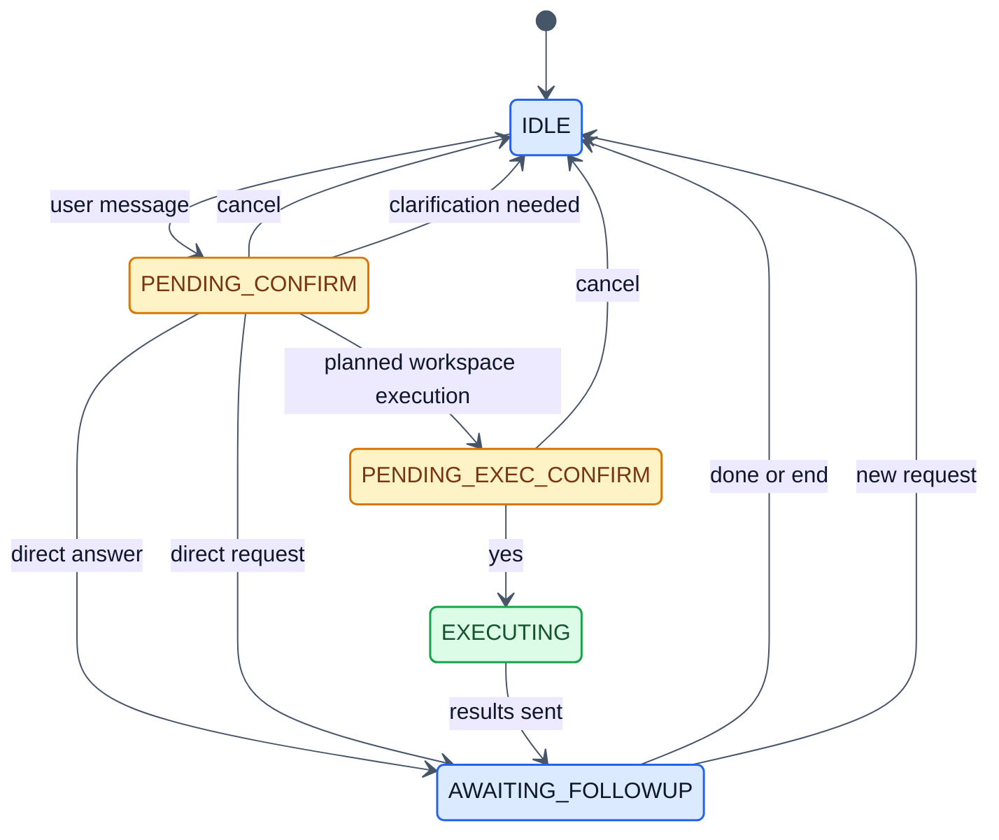

### Execution Flow

1. A message arrives via Slack or Telegram
2. `ConfirmGate` registers the request and asks for confirmation
3. Router identifies the target workspace set or switches to direct handling
4. `PO` creates a phased execution plan
5. Executor runs WOs phase by phase:
   - parallel within a phase
   - sequential across phases
6. upstream summaries become downstream context
7. results are written to `.tasks/`
8. formatted output is sent back to the channel

---

## Remote Workspaces

When a workspace lives on another machine or Kubernetes pod, use a remote listener.

### Listener Environment

The remote listener understands:

- `LISTENER_CWD`
- `LISTENER_PORT`
- `LISTENER_TOKEN`
- `LISTENER_RUNTIME`

### Setup

```bash
# Via SSH
/setup-remote-project

# Via kubectl
/setup-remote-workspace
```

The deploy helper in `orchestrator/remote/deploy.py` supports both SSH and `kubectl`.

### Config

Preferred new schema:

```yaml
workspaces:
  - id: staging
    path: services/staging
    wo:
      runtime: opencode
      mode: remote
      remote:
        host: 10.0.0.5
        port: 9100
        token: ""
```

Legacy compatibility projection:

```yaml
remote_workspaces:
  - name: staging
    host: 10.0.0.5
    port: 9100
    token: ""
    runtime: opencode
```

### Remote Host Requirements

- Python 3.10+
- `claude-agent-sdk` and `aiohttp` if the remote runtime is `claude`
- `cursor-agent` CLI if the remote runtime is `cursor`
- `codex` CLI if the remote runtime is `codex`
- `opencode` CLI plus provider credentials if the remote runtime is `opencode`

---

## Channel Setup Guides

### Slack

Slack support exists in `orchestrator/channel/slack.py`, but Slack libraries are optional.

Install them if you want Slack support:

```bash
.venv/bin/pip install slack-bolt slack-sdk
```

Then:

1. create a Slack app at [api.slack.com/apps](https://api.slack.com/apps)
2. enable Socket Mode
3. generate an app-level token with `connections:write`
4. add bot scopes:
   - `chat:write`
   - `channels:history`
   - `groups:history`
   - `im:history`
   - `mpim:history`
   - `app_mentions:read`
5. subscribe to bot events:
   - `message.channels`
   - `message.groups`
   - `message.im`
   - `app_mention`
6. install the app to the workspace
7. write credentials into `ARCHIVE/slack/credentials`

### Telegram

Telegram support is implemented in `orchestrator/channel/telegram.py`.

1. create a bot with [@BotFather](https://t.me/botfather)
2. write `ARCHIVE/telegram/credentials`
3. enable Telegram in `orchestrator.yaml`

---

## Configuration Reference

`orchestrator.yaml` now looks like this:

```yaml
root: /path/to/po-root
archive: /path/to/po-root/ARCHIVE

runtime:
  default: claude
  roles:
    router: claude
    planner: claude
    executor: claude
    direct_handler: claude
    repair: claude

channels:
  slack:
    enabled: false
  telegram:
    enabled: true

workspaces:
  - id: backend
    path: backend
    wo:
      runtime: codex
      mode: local

  - id: staging
    path: services/staging
    wo:
      runtime: opencode
      mode: remote
      remote:
        host: 10.0.0.5
        port: 9100
        token: ""

remote_workspaces:
  - name: staging
    host: 10.0.0.5
    port: 9100
    token: ""
    runtime: opencode
```

Key fields:

- `root`: the PO root
- `archive`: credential storage path
- `runtime.default`: default runtime for roles without explicit overrides
- `runtime.roles`: per-role runtime overrides
- `workspaces[].id`: workspace identifier used by the planner and executor
- `workspaces[].path`: actual workspace path relative to `root`
- `workspaces[].wo.runtime`: runtime for that workspace
- `workspaces[].wo.mode`: `local` or `remote`
- `workspaces[].wo.remote`: remote listener connection information
- `remote_workspaces`: legacy compatibility projection used by older remote lookups

---

## Credential File Format

All credential files use `key : value` format with spaces around the colon.

```text
# ARCHIVE/slack/credentials
app_id : A012345
client_id : 123456.789012
client_secret : your-secret
signing_secret : your-signing-secret
app_level_token : xapp-1-xxx
bot_token : xoxb-xxx

# ARCHIVE/telegram/credentials
bot_token : 123456:ABC-DEF1234
allowed_users : username1, username2
```

---

## Security Model

1. **User-controlled input isolation**: channel content is wrapped and handled separately from system instructions
2. **Workspace validation**: only configured or discovered real workspaces are eligible targets
3. **Path traversal prevention**: invalid names and blocked paths are rejected
4. **Sensitive directory blocking**: `ARCHIVE/`, `.tasks/`, `.git/`, `.claude/`, `.cursor/`, `.opencode/`, and `orchestrator/` are excluded from targeting
5. **Workspace sandboxing**: each WO executes with its own `cwd`
6. **Channel confirmation**: channel execution is gated by explicit confirm/cancel state

---

## Customization

### Adding a Custom Channel

Inherit from `BaseChannel` in `orchestrator/channel/base.py`:

```python
from orchestrator.channel.base import BaseChannel


class MyChannel(BaseChannel):
    channel_name = "mychannel"

    async def _send(self, callback_info, text):
        ...

    async def start(self):
        ...

    async def stop(self):
        ...
```

Then register it in `orchestrator/main.py`.

### Customizing the Direct Handler

Adjust the system prompt in `orchestrator/direct_handler.py` to integrate your own internal tools or policies.

### Customizing Workspace Behavior

Control WO behavior through guidance files:

- `AGENTS.md` should hold shared repo rules for `cursor`, `codex`, and `opencode`, and is the best default for runtime-neutral instructions
- `CLAUDE.md` should hold Claude-specific framing when the `claude` runtime needs extra project context
- `.cursor/rules/` should hold Cursor-specific `.mdc` rule files, and `.cursorrules` should be kept only for legacy compatibility
- `opencode.json` and `.opencode/skills/` should hold OpenCode-only config and project-local skills when you need them
- `.claude/` should be kept only for Claude memory, rules, and skills you still actively depend on

The setup flow creates root-level `AGENTS.md` and `CLAUDE.md` when missing, and when those files already exist it appends or refreshes a managed Project Orchestrator integration block instead of overwriting the rest of your guidance. It also scaffolds `opencode.json` plus `.opencode/` when OpenCode is selected. Cursor uses `.cursor/rules` when your repo already defines project rules. In practice, treat `AGENTS.md` as the shared contract across runtimes, then layer Claude-only behavior in `CLAUDE.md` or `.claude/`, Cursor-only behavior in `.cursor/rules` or legacy `.cursorrules`, and OpenCode-only behavior in `opencode.json` or `.opencode/`.

---

## Dependencies

| Package | Required | When |
|---------|----------|------|
| `claude-agent-sdk` | Always | Claude runtime |
| `aiohttp` | Always | HTTP server/client and remote listener |
| `pyyaml` | Always | Config loading |
| `requests` | If remote deployment helpers are used | SSH and kubectl deployment flows |
| `InquirerPy` | Always | Setup wizard prompts |
| `cursor-agent` | If Cursor | Cursor CLI runtime |
| `@openai/codex-sdk` | Always after `npm install` | Codex runtime bridge |
| `@opencode-ai/sdk` | Always after `npm install` | OpenCode runtime bridge |
| `slack-bolt` + `slack-sdk` | If Slack | Slack adapter |

Telegram uses `aiohttp`, which is already required.

---

## Running

```bash
# Foreground
./start-orchestrator.sh --fg

# Background
./start-orchestrator.sh

# Logs
tail -f /tmp/orchestrator-$(date +%Y%m%d).log

# Reconfigure
.venv/bin/python -m orchestrator.setup_tui

# Validate Mermaid diagrams in docs
npm run validate:mermaid

# Stop
kill $(pgrep -f "orchestrator.main")
```

---

## Scaling Beyond — Hierarchical Orchestration

A single PO manages one project tree. If your organization has multiple systems, each system can run its own orchestrator and a higher-level orchestrator can route across them.

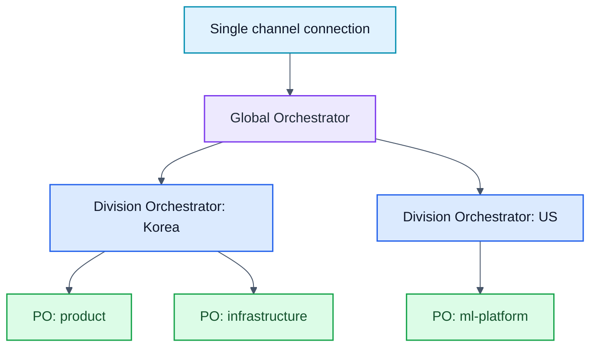

The same rule still applies: each layer only needs to know its direct children.

---

## Contributing

Contributions are welcome.

1. Fork the repository
2. Create a feature branch: `git checkout -b codex/my-feature`
3. Commit your changes
4. Push the branch
5. Open a Pull Request

### Areas We'd Love Help With

- new channel adapters
- stronger remote runtime support
- test coverage and CI
- documentation translations

---

## Roadmap

- [ ] Microsoft Teams channel adapter
- [ ] Discord channel adapter
- [ ] Web dashboard for runtime and workspace visibility
- [ ] Richer hierarchical orchestration support
- [ ] Automatic workspace dependency graph inference
- [ ] Rollback support on failed workspace execution
- [ ] Streaming progress updates back to the channel
- [ ] Cost tracking by task, workspace, and runtime

---

## License

MIT License
