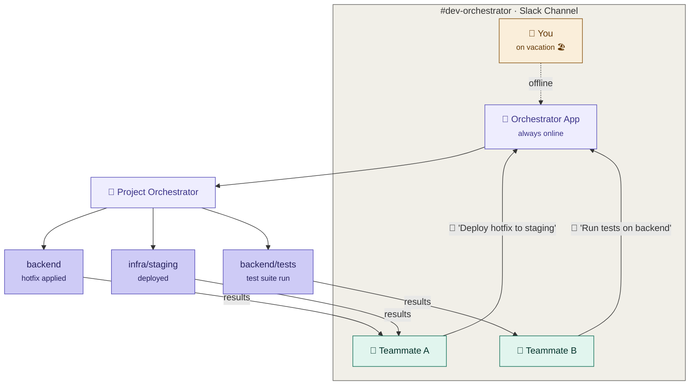
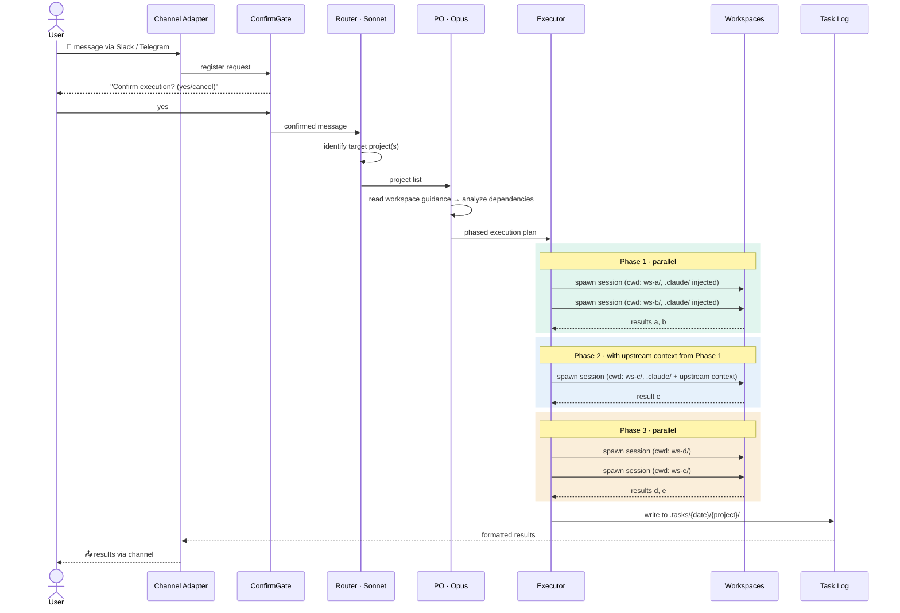
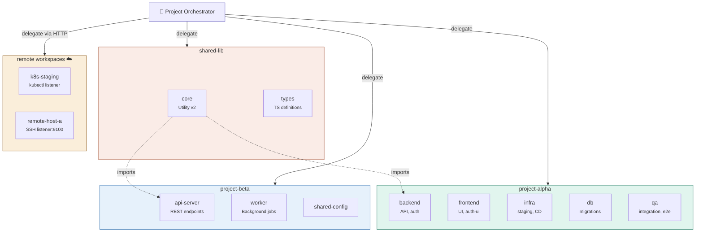
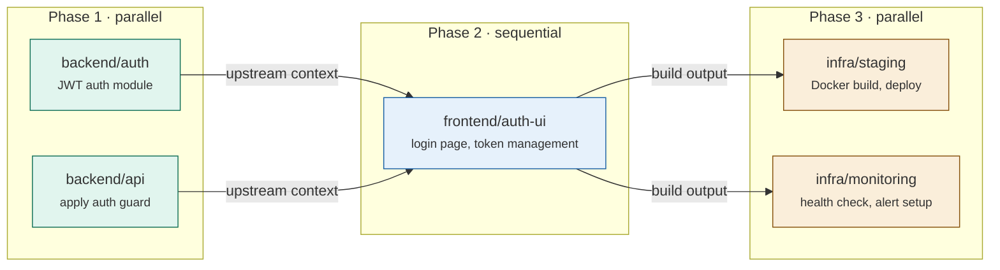
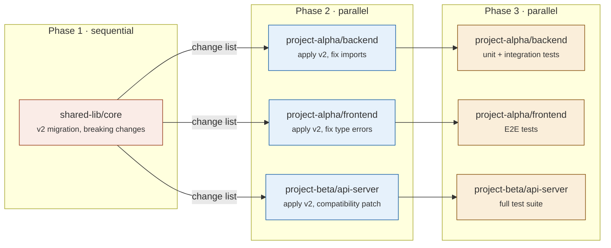
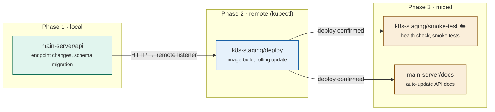
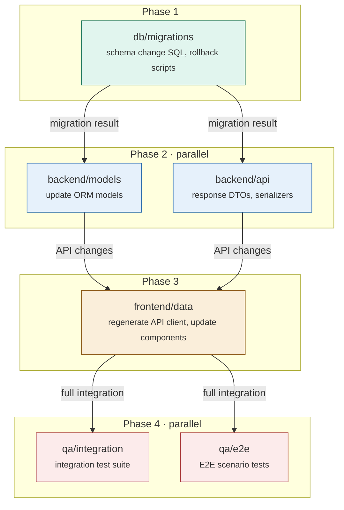
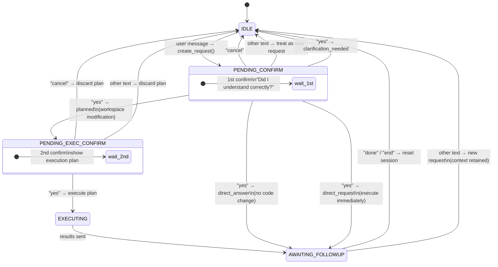

# Claude-Code-Tunnels

**Turn any project folder into an AI-orchestrated workspace with Slack and Telegram integration.**

Claude-Code-Tunnels adds an always-on orchestration layer on top of your project folders. Send a message from Slack or Telegram and the control plane figures out which workspace should handle it, plans phase ordering, runs the task in the configured runtime, and returns structured results.

## Terminology

- **Project Orchestrator (PO)**: The control plane. It receives requests, routes them, builds execution plans, and coordinates work.
- **Workspace**: A real code or document directory that contains the target work.
- **Workspace Orchestrator (WO)**: The execution unit for one workspace. A WO runs with one runtime such as `claude`, `codex`, or `opencode`.
- **Executor**: The component that runs WOs phase by phase, with parallel execution inside a phase and ordered dependencies between phases.
- **Remote Workspace**: A workspace executed through the remote listener on another host or pod.

## Start Here

```bash
./install.sh
.venv/bin/python -m orchestrator.setup_tui
./start-orchestrator.sh --fg
```

The setup TUI checks whether the current folder already looks like a PO root, suggests workspace candidates, lets you define PO and WO mappings, enables channels, and writes `orchestrator.yaml` plus `start-orchestrator.sh`.

## How To Run

After setup has written `orchestrator.yaml` and `start-orchestrator.sh`, use these commands from the PO root:

```bash
# Foreground (recommended for first run / debugging)
./start-orchestrator.sh --fg

# Background (daemon mode)
./start-orchestrator.sh

# Re-open setup
.venv/bin/python -m orchestrator.setup_tui

# View logs
tail -f /tmp/orchestrator-$(date +%Y%m%d).log

# Stop the background process
kill $(pgrep -f "orchestrator.main")
```

```
 Slack / Telegram
          │
    ┌─────▼─────┐
    │  Channel   │  (message receive, confirm gate)
    │  Adapter   │
    └─────┬─────┘
          │
    ┌─────▼─────┐
    │   Router   │  (identify target project)
    └─────┬─────┘
          │
    ┌─────▼─────┐
    │     PO     │  (analyze request → build phased execution plan)
    └─────┬─────┘
          │
    ┌─────▼─────┐
    │  Executor  │  (phase-by-phase WO execution)
    │            │
    │  Phase 1:  │──→ [ws-a] [ws-b]  (parallel)
    │  Phase 2:  │──→ [ws-c]         (runs after phase 1)
    └─────┬─────┘
          │
    ┌─────▼─────┐
    │  Task Log  │  (.tasks/ directory, 30-day retention)
    └─────┬─────┘
          │
    ┌─────▼─────┐
    │  Channel   │  (format and return results)
    │  Adapter   │
    └───────────┘
```

---

## Difference from Claude Code's Built-in Channels

Claude Code recently introduced a [Channels feature](https://docs.anthropic.com/en/docs/claude-code/channels) (research preview) — it forwards Telegram/Discord messages to a running CLI session. Here is why Claude-Code-Tunnels is fundamentally different:

| Feature | Claude Code Channels | Claude-Code-Tunnels |
|---------|---------------------|---------------------|
| **Architecture** | Single CLI session, single working directory | Always-on server with multi-project orchestration |
| **Session Model** | Session-dependent (stops when CLI exits) | Background daemon (persists after disconnect) |
| **Multi-project** | 1 session = 1 project | PO routes to all projects, parallel execution possible |
| **Workspace Orchestration** | None — simple message bridge | Phase-based dependency analysis, parallel execution, upstream context passing |
| **Supported Channels** | Telegram, Discord (preview) | **Slack, Telegram** |
| **Confirm Gate** | None | Built-in: user confirmation required before execution |
| **Task Log** | None | `.tasks/` auto-logging, 30-day retention |
| **Remote Workspaces** | Not supported | SSH/kubectl listener for external servers and K8s pods |
| **Conversation Memory** | Single session context | Per-source sessions (turn history + state machine) |
| **Add Custom Channel** | Requires `--dangerously-load-development-channels` | Inherit Python `BaseChannel` — add in minutes |
| **Security Model** | Sender allowlist only | XML tag isolation + path traversal prevention + prompt injection defense |
| **Runtime** | Requires Bun | Python control plane + Node bridge for `codex` / `opencode` |
| **Permissions Model** | Interactive prompts block execution | `bypassPermissions` support for unattended operation |

**In short**: Claude Code Channels is a raw message bridge into a single session. Claude-Code-Tunnels is a full orchestration layer — each workspace runs in its own isolated session, and one channel connection scales to any number of projects.

---

## Team Collaboration — Shared Channel, Zero Handoff

Traditional setups tie the AI assistant to one person's session. Claude-Code-Tunnels flips this: **the orchestrator lives in the Slack channel, not on anyone's laptop**. Invite the app to a shared channel, invite your teammates — now anyone in the channel can interact with the orchestrator. When you're on vacation, out sick, or simply offline, your team keeps working with full access to every project and workspace.


**No handoff required.** The orchestrator already knows each workspace's structure through guidance files such as `CLAUDE.md`, `AGENTS.md`, and workspace configuration. A teammate doesn't need your local environment, your CLI session, or your explanation of "how things are set up." They just type a message in the channel.

| Scenario | Without Tunnels | With Tunnels |
|----------|----------------|--------------|
| You're on vacation | Team waits or struggles with unfamiliar setup | Team messages the channel, orchestrator handles it |
| New team member joins | Needs onboarding on every project's tooling | Posts in the channel, gets results immediately |
| Urgent hotfix at 3 AM | Someone must SSH in and run commands manually | Anyone in the channel triggers the full pipeline |
| Knowledge transfer | Docs, meetings, shadowing sessions | The orchestrator *is* the institutional knowledge |

> **One app. One channel. The whole team.** The orchestrator doesn't care who's asking — it routes to the right workspace, builds the execution plan, and delegates to WOs. Your team's velocity is no longer bottlenecked by any single person's availability.

---

## How Delegation Works

The core value of Claude-Code-Tunnels is **delegation** — even with dozens of projects and workspaces, the PO analyzes a single natural-language request, identifies the right targets, builds a dependency-aware execution plan, and delegates each piece to the appropriate WO. You never have to specify which project or workspace to touch.

Two properties make this scale:

**1. Isolated sessions per workspace.** Every delegation spawns a fresh runtime session with `cwd=workspace/` and loads only that workspace's guidance and local memory. Each WO works with full focus on exactly one workspace — no context bleed between workspaces, no shared state.

**2. Unbounded tree depth.** One channel connection is all you need. Add more projects, add more workspaces inside them, add remote workspaces on other machines — the tree can grow arbitrarily deep. The PO discovers structure at runtime by reading workspace guidance files, so there is very little to reconfigure as the tree grows.

### Delegation Flow



> **Key insight**: Phase 1 workspaces run **in parallel**. Phase 2 waits for Phase 1 to complete and receives its results as **upstream context**. This means downstream workspaces always have the full picture of what changed upstream.

### Workspace Structure

The PO delegates across multiple projects and workspaces. Each project contains independent workspaces that can be targeted individually or as a group:



### Delegation Scenarios

Below are four real-world scenarios showing how a single message gets decomposed into phased, dependency-aware workspace tasks.

#### Scenario 1 — Multi-project deployment

> **Slack**: _"Add an auth module to the backend API, integrate the login UI on the frontend, then deploy to staging"_



| Phase | Mode | Workspaces | What happens |
|-------|------|------------|-------------|
| 1 | **Parallel** | `backend/auth`, `backend/api` | JWT module + guard applied simultaneously |
| 2 | Sequential | `frontend/auth-ui` | Receives Phase 1 API changes as context |
| 3 | **Parallel** | `infra/staging`, `infra/monitoring` | Deploy + monitoring setup after frontend ready |

#### Scenario 2 — Cross-project refactoring

> **Telegram**: _"Upgrade the shared utility library to v2 and run tests across all dependent projects"_



The PO identifies that `shared-lib` must be updated **first**, then fans out to all dependent projects **in parallel**, and finally runs each project's test suite.

#### Scenario 3 — Remote workspace orchestration

> **Telegram**: _"Update the main server API and apply the changes to the K8s staging pod"_



Remote workspaces are delegated over HTTP — the executor sends tasks to a lightweight listener running on the remote host or K8s pod, which executes the configured runtime locally.

#### Scenario 4 — 4-phase complex pipeline

> **Slack**: _"DB schema change → backend migration → frontend update → full integration tests"_



Each phase strictly depends on the previous one. The PO ensures that no workspace starts until its upstream dependencies are fully resolved and their context is passed down.

---

## Quick Start

```bash
git clone https://github.com/matteblack9/claude-code-tunnels.git
cd claude-code-tunnels

./install.sh
.venv/bin/python -m orchestrator.setup_tui
./start-orchestrator.sh --fg
```

The setup TUI guides you through:
1. Checking whether the current folder already looks like a PO root
2. Suggesting PO root, ARCHIVE path, and workspace candidates
3. Defining WOs for each selected workspace
4. Choosing channel enablement and runtime defaults
5. Writing `orchestrator.yaml` and `start-orchestrator.sh`
6. Showing the exact foreground and background start commands

---

## Commands

| Command | Description |
|---------|-------------|
| `.venv/bin/python -m orchestrator.setup_tui` | Full-screen setup wizard — classify current folder, suggest workspaces, define WOs, and write config |
| `/setup-orchestrator` | Plugin skill shortcut that launches the setup TUI workflow |
| `/connect-slack` | Add a Slack channel to an existing orchestrator |
| `/connect-telegram` | Add a Telegram channel to an existing orchestrator |
| `/setup-remote-project` | Deploy listener to remote host (SSH/kubectl) to access remote projects |
| `/setup-remote-workspace` | Connect a specific remote workspace to the orchestrator |

---

## Architecture

### Component Structure

```
your-projects/
├── orchestrator/                 # Core engine
│   ├── __init__.py              # Config loading, JSON extraction
│   ├── main.py                  # Entry point (starts enabled channels)
│   ├── server.py                # ConfirmGate, handle_request, format_results
│   ├── router.py                # Lightweight project identification (Sonnet)
│   ├── po.py                    # Execution plan generation (Opus)
│   ├── executor.py              # Phase-by-phase workspace execution
│   ├── direct_handler.py        # Non-project task handling (customizable)
│   ├── task_log.py              # .tasks/ logging and archival
│   ├── sanitize.py              # Prompt injection defense
│   ├── http_api.py              # External HTTP gateway
│   ├── channel/
│   │   ├── base.py              # Abstract channel + session state machine
│   │   ├── session.py           # Per-source conversation tracking
│   │   ├── slack.py             # Slack Socket Mode + Web API
│   │   └── telegram.py          # Telegram long polling + Bot API
│   └── remote/
│       ├── listener.py          # HTTP listener for remote workspaces
│       └── deploy.py            # SSH/kubectl deployment helper
├── orchestrator.yaml             # Configuration file
├── start-orchestrator.sh         # Start script
├── ARCHIVE/                      # Credentials (never commit)
├── .tasks/                       # Execution logs (auto-generated)
├── .claude/rules/                # Orchestrator behavior rules
├── CLAUDE.md                     # Project-level instructions
├── project-a/                    # Project folder
│   ├── CLAUDE.md
│   └── workspace-1/
└── project-b/
    └── ...
```

### Agent Model Strategy

| Agent | Model | Max Turns | Role |
|-------|-------|-----------|------|
| Router | Sonnet | 8 | Fast project identification |
| PO | Opus | 15 | Deep planning with dependency analysis |
| Executor | Default | 5 | Full workspace code modification |
| DirectHandler | Sonnet | 30 | Handle other tasks (outside workspaces) |
| JSON Repair | Haiku | 1 | Cost-efficient malformed JSON recovery |

### Session State Machine (2-Step Confirmation)



The 2-step confirmation ensures that:
- **1st confirm** (`PENDING_CONFIRM`): User verifies the request was understood correctly
- **2nd confirm** (`PENDING_EXEC_CONFIRM`, workspace modifications only): User reviews the execution plan before code changes are made
- Non-modifying requests (`direct_answer`, `direct_request`) skip the 2nd confirm and go straight to `AWAITING_FOLLOWUP`

### Execution Flow

1. **Message Received** — delivered via channel adapter (Slack/Telegram)
2. **ConfirmGate** — register request, ask user for confirmation
3. **Router** (Sonnet) — identify target project
4. **PO** (Opus) — understand project structure, build phased execution plan
5. **Executor** — run workspaces (parallel within phase, sequential between phases)
6. **Upstream Context** — pass completed phase results to downstream workspaces
7. **Task Log** — record everything in `.tasks/{date}/{project}/`
8. **Return Results** — format and send back to channel

---

## Remote Workspaces

Use remote workspaces when your project lives on a different server or Kubernetes pod:

```
                  Orchestrator Host
                  ┌─────────────┐
                  │  Executor   │
                  │             │──── HTTP ────→ Remote Host A
                  │  query(cwd=)│               ┌──────────┐
                  │  local      │               │ Listener  │
                  │  workspaces │               │ port 9100 │
                  │             │               └──────────┘
                  │             │──── HTTP ────→ K8s Pod B
                  └─────────────┘               ┌──────────┐
                                                │ Listener  │
                                                │ port 9100 │
                                                └──────────┘
```

### Setup

```bash
# Via SSH
/setup-remote-project
# → Enter: host, user, remote path, port

# Via kubectl
/setup-remote-workspace
# → Enter: pod, namespace, remote path, port
```

The listener is a lightweight HTTP server that receives tasks and runs the configured runtime on the remote server. Remote host requirements:
- Python 3.10+
- `claude-agent-sdk` and `aiohttp` for `claude`
- `codex` CLI for `codex`
- `opencode` CLI plus provider credentials for `opencode`

### Configuration

Register remote workspaces in `orchestrator.yaml`:

```yaml
remote_workspaces:
  - name: my-project/backend    # workspace identifier
    host: 10.0.0.5              # remote host (or pod IP)
    port: 9100                  # listener port
    token: ""                   # optional auth token
```

---

## Channel Setup Guide

### Slack

1. Create app at [api.slack.com/apps](https://api.slack.com/apps)
2. Enable **Socket Mode** → generate app-level token (`xapp-...`)
3. Subscribe to events: `message.channels`, `app_mention`
4. Bot scopes: `chat:write`, `channels:history`, `app_mentions:read`
5. Install to workspace, copy Bot Token (`xoxb-...`)
6. Run `/connect-slack` and enter credentials

### Telegram

1. Open [@BotFather](https://t.me/botfather) on Telegram
2. Send `/newbot` and follow the prompts
3. Copy the bot token
4. Run `/connect-telegram` and enter the token

---

## Configuration File Reference

`orchestrator.yaml`:

```yaml
# Project root — directory containing your projects
root: /home/user/my-projects

# Credential storage path (never commit)
archive: /home/user/my-projects/ARCHIVE

# Channel configuration
channels:
  slack:
    enabled: false
  telegram:
    enabled: false

# Remote workspaces
remote_workspaces:
  - name: project/workspace
    host: 10.0.0.5
    port: 9100
    token: ""
```

---

## Credential File Format

All credential files use `key : value` format (space on both sides of colon):

```
# ARCHIVE/slack/credentials
app_id : A012345
client_id : 123456.789012
client_secret : your-secret
signing_secret : your-signing-secret
app_level_token : xapp-1-xxx
bot_token : xoxb-xxx

# ARCHIVE/telegram/credentials
bot_token : 123456:ABC-DEF1234
allowed_users : username1, username2
```

---

## Security Model

1. **XML Tag Isolation**: User input wrapped in `<user_message>` tags; system prompt explicitly ignores instructions inside that tag
2. **Filesystem Validation**: Only actual project/workspace directories allowed
3. **Path Traversal Prevention**: Rejects names containing `/`, `\`, `..`
4. **Sensitive Directory Blocking**: `ARCHIVE/`, `.tasks/`, `.git/`, `.claude/` excluded from task targets
5. **Workspace Sandboxing**: Each executor agent restricted to its workspace via `cwd=`

---

## Customization

### Add a Custom Channel

Inherit from `BaseChannel`:

```python
from orchestrator.channel.base import BaseChannel

class MyChannel(BaseChannel):
    channel_name = "mychannel"

    async def _send(self, callback_info, text):
        # Send message however you like
        ...

    async def start(self):
        # Start receiving messages
        ...

    async def stop(self):
        # Cleanup
        ...
```

Register in `main.py`:
```python
my_ch = MyChannel(confirm_gate)
register_channel("mychannel", my_ch)
```

### Customize the Direct Handler

Modify the system prompt in `orchestrator/direct_handler.py` to integrate your organization's tools and APIs (Jira, Confluence, monitoring, etc.).

### Customize Workspace Behavior

Control WO behavior via each workspace's guidance files. `CLAUDE.md` still works for Claude, and `AGENTS.md` is available for Codex and OpenCode-oriented workflows. Add build commands, test instructions, coding conventions, and runtime notes there.

---

## Dependencies

| Package | Required | When |
|---------|----------|------|
| `claude-agent-sdk` | Always | Core orchestration |
| `aiohttp` | Always | HTTP server/client |
| `pyyaml` | Always | Config file loading |
| `textual` | During setup | Setup TUI |
| `@openai/codex-sdk` | If using Codex | Node bridge runtime |
| `@opencode-ai/sdk` | If using OpenCode | Node bridge runtime |
| `slack-bolt` + `slack-sdk` | If using Slack | Socket Mode |

Telegram uses `aiohttp` (already a required dependency).

---

## License

MIT
